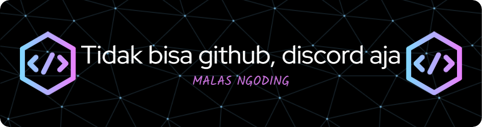

  

 <h1 align="center">Raditya</h1>

  

  

<picture>
  <source media="(prefers-color-scheme: dark)" srcset="https://raw.githubusercontent.com/VianRo/VianRo/output/pacman-contribution-graph-dark.svg">
  <source media="(prefers-color-scheme: light)" srcset="https://raw.githubusercontent.com/VianRo/VianRo/output/pacman-contribution-graph.svg">
  
</picture>

<!-- 

 -->
<!-- <h1 align="center">Hi there 👋 I'm Raditya 🙋‍♂️🧑‍🦱</h1>

 -->

<h3> About me 🤔 </h3>

💠**Sedang bersama Raja Iblis untuk menaklukkan dunia  
💠Pengguna sihir kegelapan 
💠Seorang petualang dengan rank SSS**

<h3> skills ✍️ </h3>

<h3 align="center">🔥   My Stats 🔥   </h3>

  

<iframe style="border-radius:12px" src="https://open.spotify.com/embed/track/397jCX8wRPKsSZTDcAUccg?utm_source=generator" width="100%" height="352" frameBorder="0" allowfullscreen="" allow="autoplay; clipboard-write; encrypted-media; fullscreen; picture-in-picture" loading="lazy"></iframe>

